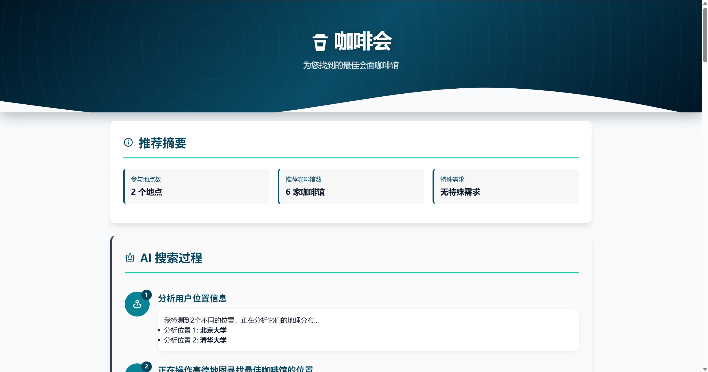
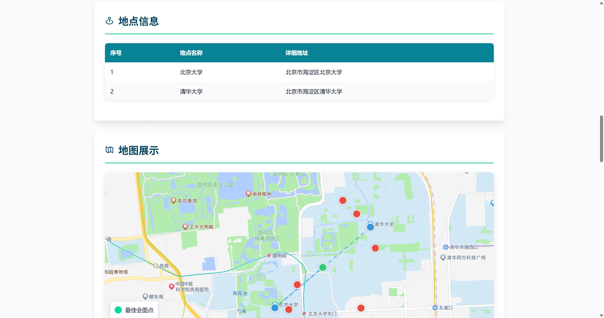
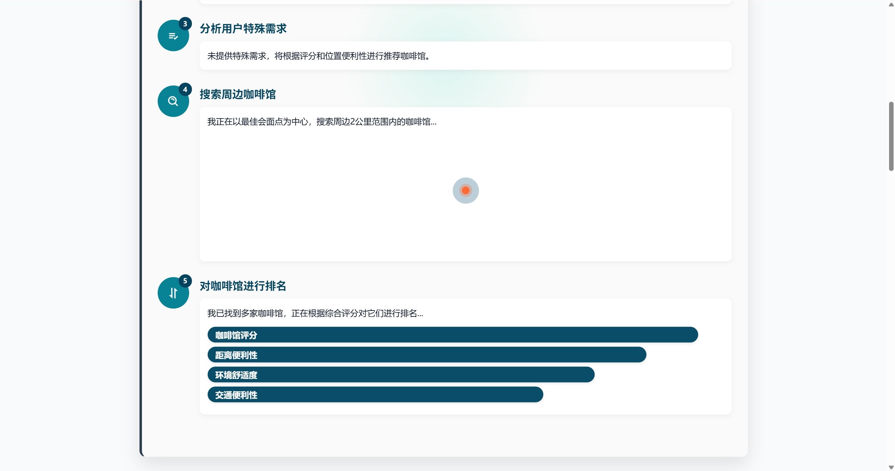

<div align="center">

# MeetSpot 聚点


**多人会面地点推荐 Agent**

[](https://opensource.org/licenses/MIT)
[](https://www.python.org/downloads/)
[](https://fastapi.tiangolo.com/)
[](https://github.com/JasonRobertDestiny/MeetSpot/actions)

[在线体验](https://meetspot-irq2.onrender.com) | [演示视频](https://www.bilibili.com/video/BV1aUK7zNEvo/) | [English](README.md) | 简体中文

</div>

## 什么是 MeetSpot？

MeetSpot 是一款多人会面地点推荐的 Agent。用户输入多个出发地址，系统自动计算最公平的中心点，并智能推荐周边咖啡馆、餐厅等场所。核心特点：LLM 智能评分排序、个性化交通建议、交互式地图展示。适用于朋友聚会、商务会谈、多人约会等场景，让"在哪见面"不再是难题。

<div align="center">

</div>

## 核心功能

- **LLM 智能评分**：AI 驱动的场所排序，基于用户需求而非仅靠评分
- **个性化交通建议**：LLM 生成智能停车与出行建议
- **交互式地图展示**：可视化中心点、参与者位置、场所标记
- **智能中心点计算**：球面几何算法确保每个人的路程都公平
- **多场景同时搜索**：咖啡馆 + 餐厅 + 图书馆一次搜完
- **支持 2-10 人**：多人聚会一键解决
- **45+ 大学简称**："北大"自动识别为"北京大学"
- **350+ 城市覆盖**：基于高德地图 API
- **AI 智能客服**：内置 AI 助手解答使用问题

<div align="center">

</div>

## 产品截图

### AI 智能客服
<div align="center">

</div>

### 地图展示
<div align="center">

</div>

### 推荐地点
<div align="center">

</div>

### 智能交通建议
<div align="center">

</div>

### 高德地图导航
<div align="center">

</div>

## 快速开始

### 环境要求

- Python 3.11+
- 高德地图 API 密钥（[申请地址](https://lbs.amap.com/)）

### 安装

```bash
git clone https://github.com/JasonRobertDestiny/MeetSpot.git
cd MeetSpot
pip install -r requirements.txt

# 配置 API 密钥
cp config/config.toml.example config/config.toml
# 编辑 config/config.toml，填入高德地图 API 密钥

# 启动服务
python web_server.py
```

浏览器访问：http://127.0.0.1:8000

## 使用方法

1. **输入地址**：添加 2-10 个参与者地址（支持"北大"、"国贸"等简称）
2. **选择场所**：选择 1-3 种类型（咖啡馆、餐厅、图书馆、KTV、健身房等）
3. **设置需求**：可选 - 停车方便、环境安静、有包间
4. **获取结果**：点击搜索，0.3-0.8 秒内出结果

<div align="center">

</div>

## API 接口

### 主要端点

```bash
POST /api/find_meetspot
```

### 请求示例

```bash
curl -X POST "http://127.0.0.1:8000/api/find_meetspot" \
  -H "Content-Type: application/json" \
  -d '{
    "locations": ["北京大学", "清华大学"],
    "keywords": "咖啡馆 餐厅",
    "user_requirements": "停车方便"
  }'
```

### 响应示例

```json
{
  "success": true,
  "html_url": "/workspace/js_src/place_recommendation_20250614_abc123.html",
  "locations_count": 2,
  "keywords": "咖啡馆 餐厅",
  "processing_time": 0.52
}
```

### 其他端点

| 端点 | 说明 |
|------|------|
| `GET /` | 首页 |
| `GET /health` | 健康检查 |
| `GET /about` | 关于页面 |
| `GET /faq` | 常见问题 |
| `GET /how-it-works` | 使用指南 |
| `GET /meetspot/{city}` | 城市落地页 |
| `POST /api/ai_chat` | AI 智能客服 |

## 技术栈

**后端**：FastAPI, Pydantic, aiohttp, SQLAlchemy, OpenAI API
**前端**：HTML5, CSS3, Vanilla JS, Boxicons
**地图**：高德地图 API
**AI**：DeepSeek / GPT-4o-mini (LLM 动态内容生成)
**设计**：Urban Navigator 主题，现代地图风格

## 性能指标

| 场景 | 响应时间 |
|------|----------|
| 单场景推荐 | 0.3-0.4 秒 |
| 双场景推荐 | 0.5-0.6 秒 |
| 三场景推荐 | 0.7-0.8 秒 |

## 测试

```bash
# 健康检查
curl http://127.0.0.1:8000/health

# SEO 验证
python verify_seo.py

# 集成测试
curl -X POST "http://127.0.0.1:8000/api/find_meetspot" \
  -H "Content-Type: application/json" \
  -d '{"locations": ["北京大学", "清华大学"], "keywords": "咖啡馆"}'
```

## 项目结构

```
MeetSpot/
├── api/
│   ├── index.py              # FastAPI 应用和主要端点
│   ├── routers/
│   │   ├── seo_pages.py      # SEO 页面 (/, /about, /faq 等)
│   │   └── auth.py           # 认证端点
│   └── services/
│       └── seo_content.py    # SEO 内容生成
├── app/
│   ├── tool/
│   │   └── meetspot_recommender.py  # 核心推荐引擎
│   ├── config.py             # 配置模型
│   ├── llm.py                # LLM 集成
│   └── design_tokens.py      # 设计系统
├── templates/                # Jinja2 模板
│   ├── base.html
│   └── pages/
├── public/                   # 静态文件
│   └── meetspot_finder.html  # 主搜索页面
├── docs/                     # 文档和截图
├── config/
│   └── config.toml.example   # 配置模板
└── web_server.py             # 入口文件
```

## 贡献

1. Fork 本仓库
2. 创建功能分支 (`git checkout -b feature/amazing`)
3. 提交更改 (`git commit -m 'Add amazing feature'`)
4. 推送分支 (`git push origin feature/amazing`)
5. 提交 Pull Request

## 许可证

MIT License - 详见 [LICENSE](LICENSE)

## 联系方式

- 邮箱：Johnrobertdestiny@gmail.com
- 问题反馈：[GitHub Issues](https://github.com/JasonRobertDestiny/MeetSpot/issues)
- 微信：

## 致谢

- [高德地图](https://lbs.amap.com/) - 地理编码和 POI 搜索
- [FastAPI](https://fastapi.tiangolo.com/) - Web 框架
- [Boxicons](https://boxicons.com/) - 图标库
- [DeepSeek](https://www.deepseek.com/) - LLM 服务

---

<div align="center">

**觉得有用请给个 Star！**

Made by [JasonRobertDestiny](https://github.com/JasonRobertDestiny)

</div>
